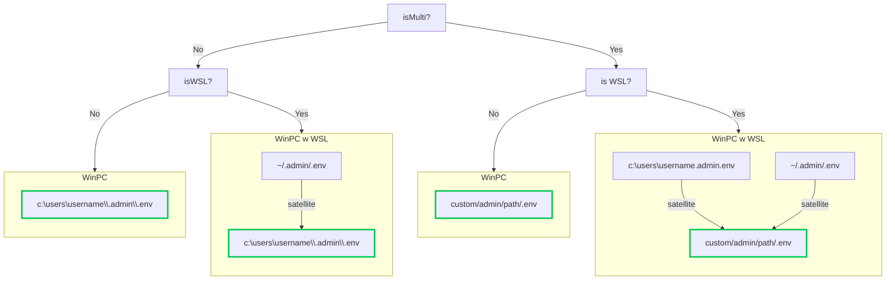

```mermaid
flowchart TB

    %% Top decision
    A["isMulti?"]

    %% Branches from isMulti
    A -- No --> B["isWSL?"]
    A -- Yes --> C["is WSL?"]

    %% ================= LEFT SIDE (isMulti = No) =================

    %% No → No  (now in container)
    B -- No --> LContainer0

    subgraph LContainer0["WinPC"]
        direction TB
        L0["c:\users\username\\.admin\\.env"]
    end

    %% No → Yes
    B -- Yes --> LContainer1

    subgraph LContainer1["WinPC w WSL"]
        direction TB
        L1["~/.admin/.env"]
        L2["c:\users\username\\.admin\\.env"]
        L1 -- satellite --> L2
    end


    %% ================= RIGHT SIDE (isMulti = Yes) =================

    %% Yes → No
    C -- No --> RContainer1

    subgraph RContainer1["WinPC"]
        direction TB
        R1["custom/admin/path/.env"]
    end

    %% Yes → Yes
    C -- Yes --> RContainer2

    subgraph RContainer2["WinPC w WSL"]
        direction TB
        R3["c:\users\username.admin.env"]
        R4["custom/admin/path/.env"]
        R5["~/.admin/.env"]

        R3 -- satellite --> R4
        R5 -- satellite --> R4
    end


    %% ================= STYLING =================
    %% Green outline for main paths in each container

    style L0 stroke:#00c853,stroke-width:3px
    style L2 stroke:#00c853,stroke-width:3px
    style R1 stroke:#00c853,stroke-width:3px
    style R4 stroke:#00c853,stroke-width:3px
```